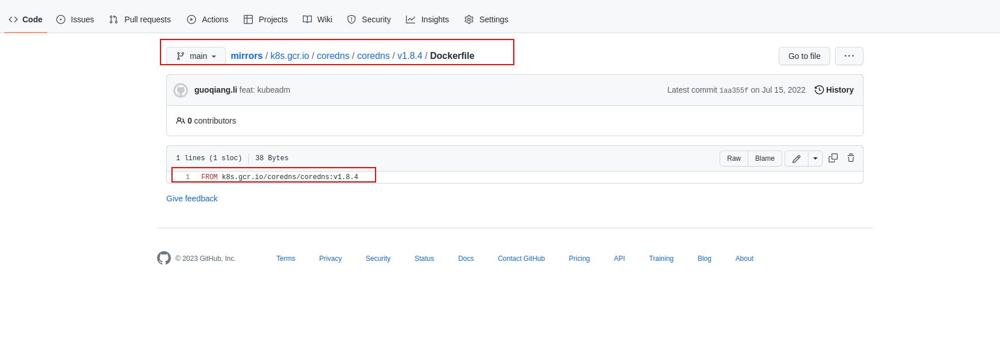
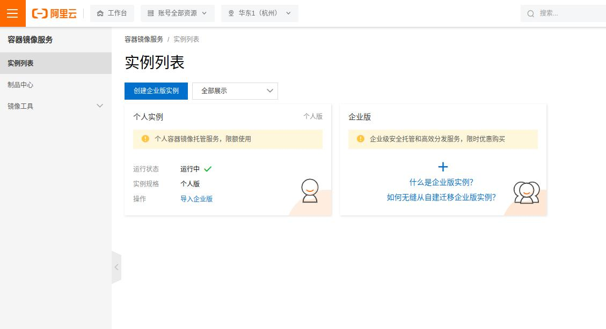
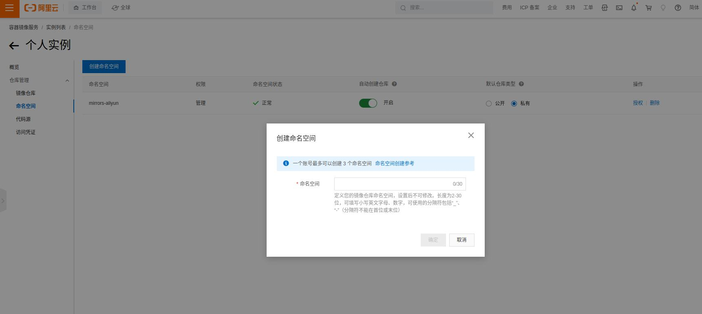
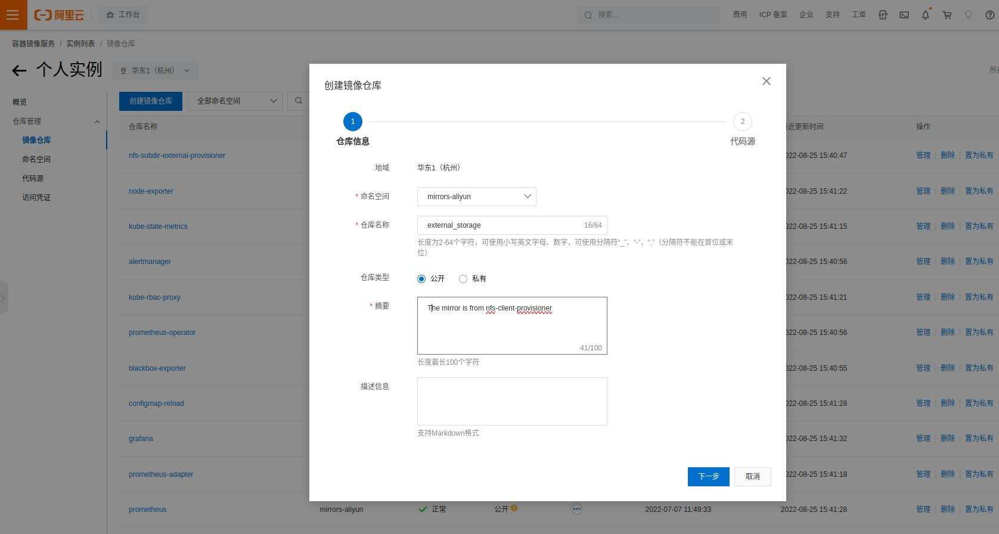
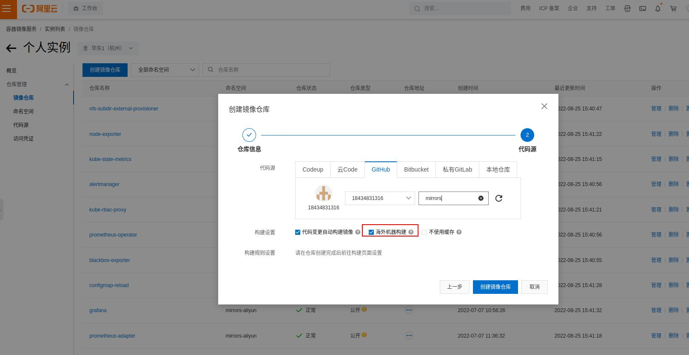
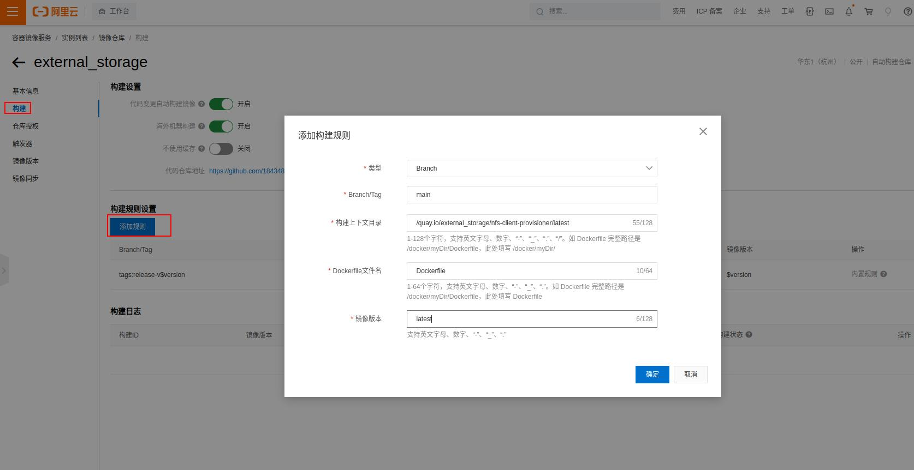
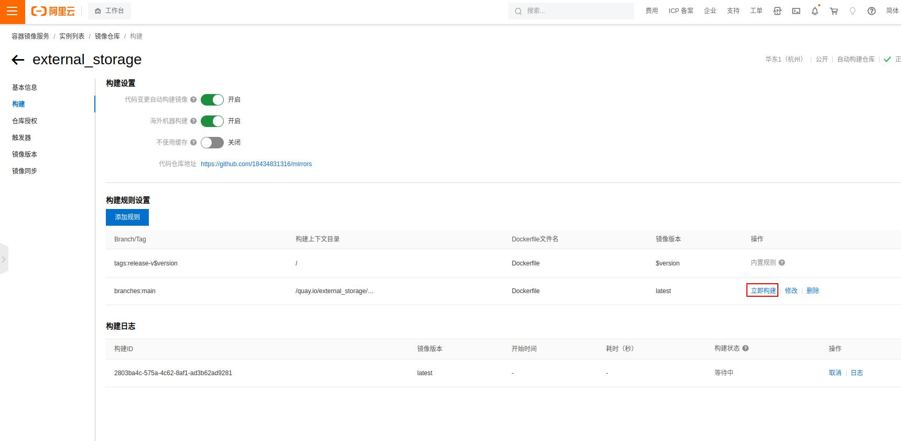

# mirrors

11111111111111111111111
222222222222222222222
## 使用阿里云容器镜像服务 + GitHub

1. 首先我们登陆GitHub创建一个自己的公有仓库，比如这边我就创建了一个叫做mirror的公开的空仓库
  
创建好仓库之后，按照个人的喜好开始准备创建对应Dockerfile，以下就按照原始镜像的全名创建对应的路径，便于使用和查找。例如，这边我们就在仓库的根目录创建了/k8s.gcr.io/sig-storage/nfs-subdir-external-provisioner/v4.0.2文件夹，文件夹里只有一个Dockerfile文件，内容只有一句话，就是FROM+我们需要拉取的镜像名称，如下所示

```
FROM quay.io/external_storage/nfs-client-provisioner:latest
```

GitHub截图如下，也可以通过以下地址查看本文的实例：k8s.gcr.io/coredns/coredns/v1.8.4/Dockerfile


2. GitHub的仓库创建完毕，并且提交了相应的Dockerfile文件之后，在GitHub上的操作就结束了。

接下来我们访问阿里云的容器镜像服务网站进行注册登陆：https://cr.console.aliyun.com

登陆成功后，自行选择创建个人或者企业实例


3. 创建好实例之后，进入对应的实例，然后创建一个命名空间，根据自己的用途取一个名字
   

4. 创建好命名空间之后，根据我们的需要任意选择一个地区，然后开始创建镜像仓库。选择我们刚才创建的命名空间，并且设置仓库的名称，也就是我们要下载的docker镜像的名称，最好与官方镜像保持一致
   

5. 设置好仓库的基本信息之后，下一步就是要关联到我们刚才创建并提交了Dockerfile的GitHub仓库，注意一定要勾选海外机器构建，因为我们要拉取海外服务器的镜像

  

6. 镜像创建完毕之后，我们进入构建页面，点击添加规则，选择我们刚才提交的代码分支，以及上下文目录和Dockerfile文件名，以及镜像版本号，建议版本号跟原始镜像保持一致，以免管理混乱。

  
7. 规则添加完毕之后，我们就可以点击立即构建开始构建我们自己的docker镜像了
  

8. 等待构建完成之后，进入基本信息页面，直接复制这个公有网址就可以进行镜像拉取了
  
9. 在我们自己要部署的服务器上拉取镜像，记得加上我们之前打的版本号
  ```
  docker pull registry.cn-hangzhou.aliyuncs.com/mirrors-aliyun/external_storage:latest
  ```
   输出结果如下
   ```
   latest: Pulling from mirrors-aliyun/external_storage
   a073c86ecf9e: Pull complete 
   d9d714ee28a7: Pull complete 
   36dfde95678a: Pull complete 
   Digest: sha256:bf2c2e662abf2c3daa0ffc608bf98a35fd48ce69510ffbf60d84f9791b737418
   Status: Downloaded newer image for registry.cn-hangzhou.aliyuncs.com/mirrors-aliyun/external_storage:latest
   registry.cn-hangzhou.aliyuncs.com/mirrors-aliyun/external_storage:latest

   ```
10. 再次使用docker images命令查看我们的本地镜像仓库
    ```
    registry.cn-hangzhou.aliyuncs.com/mirrors-aliyun/external_storage   latest              9b520032a721   4 years ago     45.5MB
    ```
11. 这个时候我们可以直接使用我们自己的镜像进行部署了
  ```
  registry.cn-hangzhou.aliyuncs.com/mirrors-aliyun/external_storage:latest
  ```
12. 如果你对镜像的名称有强依赖的要求，那么可以使用以下命令创建一个新的标签，名称和标签名都和官方镜像的一样，注意第三个参数为docker images命令中输出的镜像的IMAGE ID，根据实际情况进行修改
  ```
  docker tag 9b520032a721 quay.io/external_storage/nfs-client-provisioner:latest
  ```
13. 操作完毕之后，再次使用docker images查看我们本地的镜像仓库，可以看到已经有了一个和官方镜像一样的本地镜像了，此时就可以当做官方的镜像正常使用了。
    ```
    quay.io/external_storage/nfs-client-provisioner                     latest              9b520032a721   4 years ago     45.5MB
registry.cn-hangzhou.aliyuncs.com/mirrors-aliyun/external_storage   latest              9b520032a721   4 years ago     45.5MB
    ```
